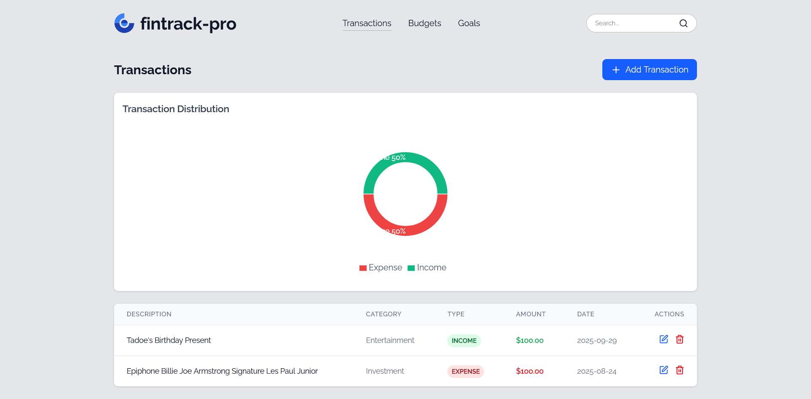

## 🎯 Project Overview

fintrack-pro is a modern, full-stack **financial tracking web application** built with the **PERN stack**, offering seamless transaction management, secure authentication, and real-time budget tracking.

## 💡 Key Features

- 💰 Track income, expenses, and savings in one place
- 📊 Visualize spending trends with charts and dashboards
- 🔐 User authentication and authorization with JWT & bcrypt
- 🧾 Transaction management with CRUD functionality
- 📄 Form validation with `validator`
- 🧭 Client-side routing with React Router
- ⚡ Built with Vite for fast development
- 🌐 Fully responsive design using Tailwind CSS
- 🧪 Automated testing with Jest and Supertest
- 🐳 Containerized with Docker for consistent environments

## 🛠️ Technologies Used

- **React 18** — UI Library
- **Vite** — Modern frontend tooling
- **React Router** — Client-side routing
- **Tailwind CSS** — Utility-first CSS framework
- **Node.js + Express** — Backend server
- **PostgreSQL + Prisma** — SQL database and ORM
- **JWT (jsonwebtoken)** — Token-based auth
- **Bcrypt** — Password hashing
- **Validator** — Form validation
- **Jest** — JavaScript testing framework
- **Supertest** — HTTP assertions for API testing
- **Recharts** — Data visualization
- **Render.com** — Deployment platform
- **Docker** — Containerization for development and deployment

## 🔗 Links

- Backend: `https://fintrack-pro-backend.onrender.com`
- Frontend: `https://fintrack-pro-frontend.onrender.com`

## 📸 Screenshots

